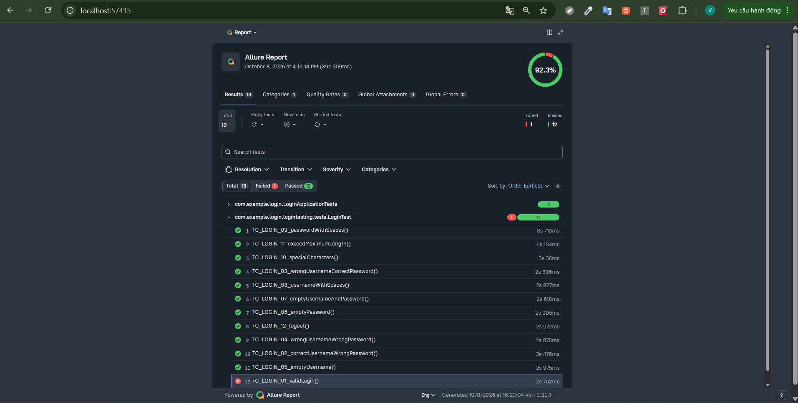

<div align="center">

# Kiểm Thử Tự Động Chức Năng Đăng Nhập


**Đồ án / Bài tập thực hành môn Kiểm Thử Phần Mềm**

Kiểm thử tự động (Automation Testing) chức năng đăng nhập  
hệ thống Văn phòng điện tử — Trường Đại học Giao thông Vận tải Cơ sở 2 (UTC2).

</div>

---

## Thông Tin Sinh Viên

| Thông tin              | Chi tiết                                                          |
| :--------------------- | :---------------------------------------------------------------- |
| **Họ và tên**          | **Nguyễn Minh Vương**                                             |
| **Mã số sinh viên**    | **6451071090**                                                    |
| **Học phần**           | Kiểm thử phần mềm                                                 |
| **Loại kiểm thử**      | Automation Testing                                                |
| **Đối tượng kiểm thử** | [Văn phòng điện tử UTC2](https://vanphongdientu.utc.edu.vn/Login) |
| **Chức năng kiểm thử** | Đăng nhập                                                         |

---

# 1. Giới Thiệu Dự Án

Dự án xây dựng một bộ **kiểm thử tự động (Automation Test Suite)** sử dụng **Java, Selenium WebDriver, JUnit 5, Maven và Allure Report** nhằm kiểm tra chức năng **Đăng nhập** của hệ thống Văn phòng điện tử UTC2.

Bộ kiểm thử gồm **12 test case**, tập trung vào các trường hợp đăng nhập hợp lệ, đăng nhập với thông tin không hợp lệ, dữ liệu bỏ trống, dữ liệu có khoảng trắng, ký tự đặc biệt, dữ liệu vượt quá giới hạn và chức năng đăng xuất.

Website được kiểm thử:

> https://vanphongdientu.utc.edu.vn/Login

---

# 2. Mục Tiêu

Dự án nhằm thực hành quy trình kiểm thử tự động trên ứng dụng web, bao gồm:

- Xây dựng các Test Case cho chức năng đăng nhập.
- Tự động hóa thao tác trên trình duyệt bằng Selenium WebDriver.
- Sử dụng JUnit 5 để tổ chức và thực thi Test Case.
- Áp dụng mô hình **Page Object Model (POM)**.
- Sử dụng Maven để quản lý dependency và chạy kiểm thử.
- Tạo báo cáo kiểm thử bằng Allure Report.
- Đánh giá kết quả kiểm thử thông qua trạng thái **Passed / Failed**.

---

# 3. Công Nghệ Sử Dụng

| Công nghệ              | Vai trò                             |
| :--------------------- | :---------------------------------- |
| **Java**               | Ngôn ngữ lập trình                  |
| **Selenium WebDriver** | Tự động hóa trình duyệt             |
| **JUnit 5**            | Framework kiểm thử                  |
| **Maven**              | Quản lý dependency và build project |
| **Allure Report**      | Báo cáo kết quả kiểm thử            |
| **Google Chrome**      | Trình duyệt kiểm thử                |
| **Page Object Model**  | Mô hình tổ chức code Selenium       |

---

# 4. Kiến Trúc Project

Project được tổ chức theo mô hình **Page Object Model (POM)**.

```text
login-testing-utc/
│
├── pom.xml
├── mvnw
├── mvnw.cmd
│
├── .mvn/
│   └── wrapper/
│
├── src/
│   ├── main/
│   │   └── java/
│   │
│   └── test/
│       └── java/
│           └── com/
│               └── example/
│                   └── login/
│                       └── logintesting/
│                           │
│                           ├── base/
│                           │   └── BaseTest.java
│                           │
│                           ├── pages/
│                           │   └── LoginPage.java
│                           │
│                           └── tests/
│                               └── LoginTest.java
│
├── target/
│   ├── allure-results/
│   └── allure-report/
│
└── README.md
```

### Vai trò các thành phần

### `BaseTest.java`

Chứa cấu hình Selenium WebDriver dùng chung cho các Test Case.

Nhiệm vụ:

- Khởi tạo ChromeDriver.
- Mở trang Login UTC2 trước mỗi Test Case.
- Đóng trình duyệt sau khi Test Case hoàn thành.

Luồng:

```text
@BeforeEach
      ↓
Khởi tạo ChromeDriver
      ↓
Mở trang Login
      ↓
Thực hiện Test Case
      ↓
@AfterEach
      ↓
driver.quit()
```

### `LoginPage.java`

Đại diện cho trang đăng nhập.

Chứa:

- Locator của Username.
- Locator của Password.
- Locator nút Đăng nhập.
- Locator form đăng nhập.
- Các phương thức thao tác với giao diện.

Các locator chính:

```java
By.name("username")
By.name("userpwd")
By.cssSelector("input.submit_login")
By.id("persistent")
By.cssSelector("form[action='/Login']")
```

### `LoginTest.java`

Chứa **12 Test Case Automation**.

Mỗi Test Case thực hiện:

```text
Khởi tạo LoginPage
        ↓
Nhập dữ liệu
        ↓
Thực hiện thao tác
        ↓
Kiểm tra kết quả bằng Assertion
```

---

# 5. Page Object Model

Dự án sử dụng **Page Object Model (POM)** nhằm tách phần xử lý giao diện khỏi phần Test Case.

Ví dụ:

```java
LoginPage loginPage = new LoginPage(driver);

loginPage.enterUsername("username");
loginPage.enterPassword("password");
loginPage.clickLogin();
```

Thay vì viết trực tiếp locator trong từng Test Case:

```java
driver.findElement(By.name("username")).sendKeys("username");
driver.findElement(By.name("userpwd")).sendKeys("password");
```

Việc sử dụng POM giúp:

- Code dễ đọc.
- Dễ bảo trì.
- Có thể tái sử dụng các thao tác.
- Khi giao diện thay đổi chỉ cần sửa locator trong `LoginPage`.

---

# 6. Yêu Cầu Môi Trường

Cần chuẩn bị:

- **JDK**
- **Google Chrome**
- **Maven** hoặc Maven Wrapper
- **Allure Commandline**

Kiểm tra Java:

```powershell
java -version
```

Kiểm tra Maven Wrapper:

```powershell
.\mvnw.cmd -version
```

Kiểm tra Allure:

```powershell
allure --version
```

---

# 7. Cài Đặt

## 7.1. Clone Project

```bash
git clone <URL_REPOSITORY>
```

Di chuyển vào thư mục project:

```bash
cd login-testing-utc
```

---

## 7.2. Maven Dependency

Các dependency chính được khai báo trong `pom.xml`.

Selenium:

```xml
<dependency>
    <groupId>org.seleniumhq.selenium</groupId>
    <artifactId>selenium-java</artifactId>
    <version>4.27.0</version>
    <scope>test</scope>
</dependency>
```

JUnit 5 và Allure được sử dụng để thực thi Test Case và tạo dữ liệu báo cáo.

---

# 8. Chạy Automation Test

## 8.1. Chạy toàn bộ 12 Test Case

Trên Windows PowerShell:

```powershell
.\mvnw.cmd clean test
```

Maven sẽ:

1. Xóa kết quả test cũ.
2. Build project.
3. Khởi tạo Chrome.
4. Mở trang Login UTC2.
5. Thực hiện 12 Test Case.
6. Chạy JUnit Assertion.
7. Sinh kết quả Allure.
8. Đóng trình duyệt.

---

## 8.2. Chạy riêng LoginTest

```powershell
.\mvnw.cmd -Dtest=LoginTest test
```

---

## 8.3. Chạy một Test Case

Ví dụ chạy TC_LOGIN_01:

```powershell
.\mvnw.cmd -Dtest=LoginTest#TC_LOGIN_01_validLogin test
```

Ví dụ chạy TC_LOGIN_05:

```powershell
.\mvnw.cmd -Dtest=LoginTest#TC_LOGIN_05_emptyUsername test
```

---

# 9. Allure Report

Sau khi chạy Automation Test, kết quả Allure được lưu tại:

```text
target/allure-results/
```

## 9.1. Generate Allure Report

Sử dụng:

```powershell
allure generate target/allure-results -o target/allure-report
```

Sau khi generate thành công, báo cáo được tạo tại:

```text
target/allure-report/
```

---

## 9.2. Mở Allure Report

```powershell
allure open target/allure-report
```

Hoặc chạy trực tiếp:

```powershell
allure serve target/allure-results
```

Allure Report cung cấp thông tin:

- Tổng số Test Case.
- Số Test Case Passed.
- Số Test Case Failed.
- Thời gian thực thi.
- Suite / Package.
- Chi tiết từng Test Case.
- Description.
- Story.
- Severity.
- Lỗi khi Test Case thất bại.

---

# 10. Danh Sách 12 Test Case

|      Mã TC      | Tên Test Case                     | Dữ liệu đầu vào                 | Kết quả mong đợi                                |
| :-------------: | :-------------------------------- | :------------------------------ | :---------------------------------------------- |
| **TC_LOGIN_01** | Đăng nhập với thông tin hợp lệ    | Username đúng / Password đúng   | Đăng nhập thành công và chuyển khỏi trang Login |
| **TC_LOGIN_02** | Username đúng, password sai       | Username đúng / Password sai    | Đăng nhập thất bại và hiển thị lỗi              |
| **TC_LOGIN_03** | Username sai, password đúng       | Username sai / Password đúng    | Đăng nhập thất bại và hiển thị lỗi              |
| **TC_LOGIN_04** | Username và password đều sai      | Username sai / Password sai     | Đăng nhập thất bại                              |
| **TC_LOGIN_05** | Bỏ trống username                 | Username rỗng / Password hợp lệ | Yêu cầu nhập username, không đăng nhập          |
| **TC_LOGIN_06** | Bỏ trống password                 | Username hợp lệ / Password rỗng | Yêu cầu nhập password, không đăng nhập          |
| **TC_LOGIN_07** | Bỏ trống cả username và password  | Username rỗng / Password rỗng   | Hiển thị yêu cầu nhập dữ liệu, không đăng nhập  |
| **TC_LOGIN_08** | Username có khoảng trắng đầu/cuối | Username có khoảng trắng        | Hệ thống xử lý theo đặc tả                      |
| **TC_LOGIN_09** | Password có khoảng trắng          | Password có khoảng trắng        | Hệ thống xử lý theo đặc tả                      |
| **TC_LOGIN_10** | Nhập ký tự đặc biệt               | Ký tự đặc biệt / chuỗi kiểm thử | Không thực thi mã độc, không crash              |
| **TC_LOGIN_11** | Nhập dữ liệu vượt quá độ dài      | Chuỗi dữ liệu rất dài           | Hệ thống validate phù hợp, không crash          |
| **TC_LOGIN_12** | Đăng xuất sau khi đăng nhập       | Tài khoản hợp lệ                | Session kết thúc và yêu cầu đăng nhập lại       |

---

</img>
